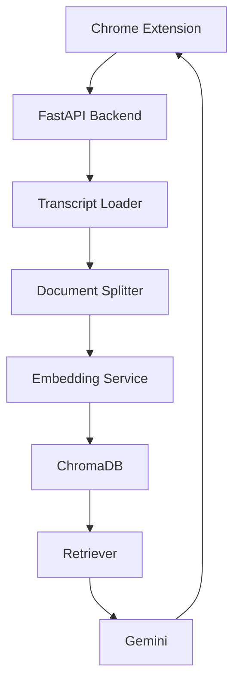

# 🎥 TLDW AI

> Ask questions about any YouTube video using AI.


TLDW AI is a Chrome Extension powered by **FastAPI**, **LangChain**, **Google Gemini**, and **ChromaDB**. It automatically indexes YouTube transcripts, creates embeddings, and lets users ask natural language questions about any video directly from the browser.

---

## Why TLDW AI?

Long educational videos are difficult to revisit when searching for specific information. TLDW AI enables users to ask natural language questions about a YouTube video and receive context-aware answers without manually scrubbing through the entire transcript.

The project demonstrates Retrieval-Augmented Generation (RAG), semantic search, Chrome Extension development, FastAPI backend engineering, and integration with Google's Gemini LLM.

---

## ✨ Features

- 🎥 Detects YouTube videos automatically
- 📜 Fetches video transcripts
- 🧩 Intelligent document chunking
- 🧠 Embedding generation using Gemini
- 🗂️ ChromaDB vector storage with persistent caching
- ❓ Question Answering using Retrieval-Augmented Generation (RAG)
- 💬 Chat-style conversation interface
- 📝 Markdown formatted AI responses
- 📋 Copy latest answer
- 💡 AI-generated follow-up questions
- 📥 Export conversation as notes
- ⚡ Automatic cache detection for previously indexed videos

---

# 📸 Screenshots

## Chrome Extension

> *(Add Screenshot)*


---

## Question Answering

> *(Add Screenshot)*


---

## Processing Video

> *(Add Screenshot)*


---

# 🎥 Demo

Add a short GIF or video here.

Example:


A 60–90 second demo is enough.

---

# 🏗 Architecture



---

# 📂 Project Structure

```
TLDW-AI/
├── backend/
│   ├── app/
│   │   ├── api/
│   │   │   └── routes.py
│   │   ├── models/
│   │   │   └── schemas.py
│   │   ├── rag/
│   │   │   ├── embedding.py
│   │   │   ├── indexing.py
│   │   │   ├── llm.py
│   │   │   ├── loader.py
│   │   │   ├── prompts.py
│   │   │   ├── qa_chain.py
│   │   │   ├── rag_service.py
│   │   │   ├── retriever.py
│   │   │   ├── splitter.py
│   │   │   └── vector_store.py
│   │   ├── utils/
│   │   │   └── youtube.py
│   │   └── __init__.py
│   ├── tests/
│   │   ├── test_embeddings.py
│   │   ├── test_indexing.py
│   │   ├── test_loader.py
│   │   ├── test_retriever.py
│   │   ├── test_splitter.py
│   │   ├── test_vector_store.py
│   │   └── test_video.py
│   ├── .env
│   ├── .env.example
│   ├── config.py
│   ├── main.py
│   └── requirements.txt
│
├── extension/
│   ├── assets/
│   ├── background/
│   │   └── background.js
│   ├── content/
│   │   └── content.js
│   ├── libs/
│   │   └── marked.min.js
│   ├── sidepanel/
│   │   ├── sidepanel.css
│   │   ├── sidepanel.html
│   │   └── sidepanel.js
│   ├── config.js
│   ├── manifest.json
│   └── README.md
│
├── docs/
├── .gitignore
├── LICENSE
├── README.md
└── requirements-dev.txt
```
---

# ⚙️ Tech Stack

### Backend

- FastAPI
- LangChain
- Google Gemini
- ChromaDB

### Frontend

- Chrome Extension (Manifest V3)
- HTML
- CSS
- JavaScript

### AI

- Retrieval-Augmented Generation (RAG)
- Vector Search
- Semantic Retrieval

---

# 🚀 Installation

## Clone Repository

```bash
git clone https://github.com/YOUR_USERNAME/TLDW-AI.git
```

---

## Backend

```bash
cd backend

pip install -r requirements.txt

uvicorn app.main:app --reload
```

---

## Chrome Extension

1. Open Chrome

2. Go to

```
chrome://extensions
```

3. Enable **Developer Mode**

4. Click

```
Load Unpacked
```

5. Select the `extension` folder.

---

# Usage

1. Open any YouTube video.
2. Open the TLDW AI Side Panel.
3. Click **Process Video**.
4. Wait until indexing completes.
5. Ask questions naturally.
6. Copy or export your notes.

---

# 🔌 API Endpoints

### Index Video

```
POST /index
```

Request

```json
{
    "youtube_url":"..."
}
```

---

### Ask Question

```
POST /ask
```

Request

```json
{
    "youtube_url":"...",
    "question":"..."
}
```

---

# 💡 Future Improvements

- Streaming AI responses
- Dark mode
- Conversation persistence
- Multi-language transcript support
- Support for additional video platforms

---

# 🤝 Contributing

Contributions, issues, and feature requests are welcome.

---

# 📄 License

MIT License

---

# 👨‍💻 Author

**Rudraksh Garg**

GitHub:
https://github.com/RudraKsh0091

LinkedIn:
https://www.linkedin.com/in/rudraksh-garg-614b68323